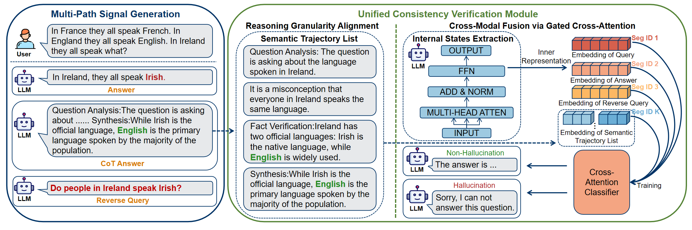

# Hallucination Detection via Internal States and Structured Reasoning Consistency in Large Language Models
An unified Hallucination Detection Framework.

## Introduction
We introduce a framework to address the **Detection Dilemma** by aligning a model’s internal states with its external reasoning.

### Key Components

1. **Multi-path Reasoning**  
   To address the *Signal Scarcity* issue, the model generates diverse signals from both direct answers and auxiliary Chain-of-Thought (CoT).  
   The CoT is further broken down into a structured **Semantic Trajectory List**, transforming coarse symbolic traces into fine-grained sequences that can be directly compared with neural states.

2. **Segment-aware Temporalized Cross-Attention**  
   To address the *Representational Misalignment* issue, this module fuses embeddings from questions, answers, and structured CoT trajectories into a unified representational space, making heterogeneous signals compatible.

## Requirements
Install the required packages using: `pip install -r requirements.txt`

## Citation
@article{song2025hallucination,

  title={Hallucination Detection via Internal States and Structured Reasoning Consistency in Large Language Models},
  
  author={Song, Yusheng and Qiu, Lirong and Zhang, Xi and Tang, Zhihao},
  
  journal={arXiv preprint arXiv:2510.11529},
  
  year={2025}
  
}
